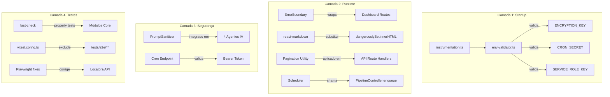

# Design Document — Plano de Correções da Auditoria

## Overview

Este design detalha as alterações cirúrgicas necessárias para resolver os 18 requisitos identificados na auditoria do i9 Wise Content. A abordagem é conservadora: edições mínimas, sem refatoração de código funcional fora do escopo, com build válido entre cada correção.

O plano organiza-se em 4 camadas:
1. **Hardening de ambiente** (Req 1-4): Validações fail-fast na inicialização
2. **Correções funcionais** (Req 5-8): ErrorBoundary, react-markdown, paginação, scheduler
3. **Qualidade de código** (Req 9-12, 16): Vitest config, sanitizer nos agentes, logger, tipos
4. **Testes** (Req 13-15, 17): Fixes E2E + property-based tests com fast-check

**Princípio**: cada correção é isolada, testável, e não introduz breaking changes.

## Architecture



## Components and Interfaces

### 1. Startup Validator (`src/lib/utils/env-validator.ts`)

**Novo módulo.** Exporta uma função `validateEnv()` chamada em `instrumentation.ts`.

```typescript
interface EnvRule {
  name: string
  required: boolean
  validate: (value: string) => boolean
  errorMessage: string
  generateHint: string
}

function validateEnv(): void
// Em dev: console.warn para variáveis ausentes
// Em prod: throw Error com mensagem descritiva
```

**Integração**: importado em `src/instrumentation.ts` (hook nativo do Next.js que roda no startup do server).

### 2. ErrorBoundary Wrapper

**Arquivo existente**: `src/components/ui/ErrorBoundary.tsx` — sem alteração no componente.

**Alteração**: Adicionar `<ErrorBoundary>` nos layouts de rota:
- `src/app/(dashboard)/layout.tsx` — wrap do `{children}`

O ErrorBoundary já registra via `console.error`. A migração para Logger será feita como parte do Req 11 (adicionar import de Logger e substituir `console.error` por `logger.error`).

### 3. Markdown Preview

**Componente afetado**: identificar via grep por `dangerouslySetInnerHTML` em `src/`.

**Substituição**:
```tsx
// Antes
<div dangerouslySetInnerHTML={{ __html: htmlContent }} />

// Depois
import ReactMarkdown from 'react-markdown'
import remarkGfm from 'remark-gfm'

<ReactMarkdown remarkPlugins={[remarkGfm]} className="prose dark:prose-invert">
  {markdownContent}
</ReactMarkdown>
```

### 4. Pagination nos API Route Handlers

**Utilitário existente**: `src/lib/utils/pagination.ts` — sem alteração.

**Alteração nos route handlers** (ex: `src/app/api/articles/route.ts`, `src/app/api/ideas/route.ts`):
```typescript
import { parsePaginationParams, createPaginatedResult, getOffset } from '@/lib/utils/pagination'

export async function GET(request: Request) {
  const { searchParams } = new URL(request.url)
  const params = parsePaginationParams(searchParams)
  
  // Query com .range() ou .limit() + .offset()
  const { data, count } = await supabase
    .from('articles')
    .select('*', { count: 'exact' })
    .range(getOffset(params), getOffset(params) + params.pageSize - 1)
    .order('created_at', { ascending: false })

  return Response.json(createPaginatedResult(data ?? [], count ?? 0, params))
}
```

### 5. Scheduler Refactor

**Arquivo**: `src/lib/pipeline/scheduler.ts`

**Mudança**:
```typescript
// Antes
await PipelineController.execute({ blogId, userId })

// Depois
await PipelineController.enqueue({ blogId, userId })
```

Remover try/catch ao redor da execução. Apenas coletar resultados de enqueue.

### 6. PromptSanitizer nos Agentes

**Arquivos**: `src/lib/ai/agents/{planner,researcher,writer,reviewer}.ts`

**Padrão de integração**:
```typescript
import { PromptSanitizer, FIELD_LIMITS } from '@/lib/ai/sanitizer'

// Antes da interpolação no prompt:
const safeName = PromptSanitizer.sanitize(blogConfig.name, { maxLength: FIELD_LIMITS.title })
const safeNiche = PromptSanitizer.sanitize(blogConfig.niche, { maxLength: FIELD_LIMITS.description })
const safeTone = PromptSanitizer.sanitize(blogConfig.toneOfVoice ?? '', { maxLength: FIELD_LIMITS.persona })
const safePersona = PromptSanitizer.sanitize(blogConfig.authorPersona ?? '', { maxLength: FIELD_LIMITS.persona })
const safeAudience = PromptSanitizer.sanitize(blogConfig.targetAudience ?? '', { maxLength: FIELD_LIMITS.persona })
```

### 7. Vitest Config Fix

**Arquivo**: `vitest.config.ts`

```typescript
test: {
  environment: 'jsdom',
  globals: true,
  setupFiles: ['./tests/setup.ts'],
  exclude: ['tests/e2e/**', 'node_modules/**'],
}
```

### 8. ANSI Strip no AuditReporter

**Função utilitária**:
```typescript
function stripAnsi(str: string): string {
  return str.replace(/\x1b\[[0-9;]*m/g, '')
}
```

Aplicada em todas as mensagens de erro antes de inserir no markdown.

### 9. Cron Endpoint Auth Fix

**Validação no handler**:
```typescript
const authHeader = request.headers.get('authorization') ?? ''
const token = authHeader.replace('Bearer ', '').trim()
const secret = process.env.CRON_SECRET ?? ''

if (!token || !secret || token !== secret) {
  return Response.json({ error: 'Unauthorized' }, { status: 401 })
}
```

## Data Models

Não há alterações no schema de banco de dados. Todas as mudanças são em código de aplicação.

A única adição de interface é o `PaginatedResult<T>` já existente em `src/lib/utils/pagination.ts`, que será usado como formato de resposta nos endpoints de listagem.

**Tipos Drizzle (Req 12)**:
```typescript
import { InferSelectModel } from 'drizzle-orm'
import { blogs, articles, pipelineRuns } from '@/lib/db/schema'

type Blog = InferSelectModel<typeof blogs>
type Article = InferSelectModel<typeof articles>
type PipelineRun = InferSelectModel<typeof pipelineRuns>
```

## Correctness Properties

*Uma propriedade é uma característica ou comportamento que deve permanecer verdadeiro em todas as execuções válidas de um sistema — essencialmente, uma declaração formal sobre o que o sistema deve fazer. Propriedades servem como a ponte entre especificações legíveis por humanos e garantias de corretude verificáveis por máquina.*

### Property 1: Round-trip de criptografia

*Para qualquer* string de input válida (não-vazia, até 10KB), `decrypt(encrypt(input))` deve ser estritamente igual ao input original.

**Validates: Requirements 17.1**

### Property 2: Sanitizador remove padrões de injection

*Para qualquer* string de input (incluindo strings contendo padrões de injection conhecidos), o output de `PromptSanitizer.sanitize()` não deve conter nenhum dos padrões definidos em `INJECTION_PATTERNS`.

**Validates: Requirements 17.2, 10.1, 10.2, 10.3, 10.4**

### Property 3: Paginação limita resultados corretamente

*Para qualquer* lista de N itens (0 ≤ N ≤ 1000) e qualquer valor de limit L (1 ≤ L ≤ 200), `parsePaginationParams` deve retornar `pageSize` ≤ 100, e `createPaginatedResult` deve retornar no máximo `min(L_capped, N)` itens, onde L_capped = min(L, 100).

**Validates: Requirements 7.1, 7.2, 7.5, 17.3**

### Property 4: Paginação cursor preserva ordenação

*Para qualquer* lista ordenada de itens e qualquer cursor válido (posição no meio da lista), todos os itens retornados pela query com cursor devem ter `created_at` > cursor. Adicionalmente, `nextCursor` deve ser non-null se e somente se existem mais itens além dos retornados.

**Validates: Requirements 7.3, 7.4**

### Property 5: Cost calculator é não-negativo e proporcional

*Para qualquer* modelo com pricing registrado e quaisquer contagens de tokens ≥ 0, o custo calculado é ≥ 0. Adicionalmente, para qualquer fator k > 0, `calculateCost(model, k*input, k*output)` deve ser igual a `k * calculateCost(model, input, output)`.

**Validates: Requirements 17.4**

### Property 6: Rate limiter permite no máximo L requests por janela

*Para qualquer* sequência de N requests (N > L) feitos dentro de uma janela de tempo W com limite L, exatamente L devem ser permitidos e o restante rejeitado. O campo `remaining` deve decrementar monotonicamente de L-1 até 0.

**Validates: Requirements 17.5**

### Property 7: State machine só alcança estados válidos

*Para qualquer* sequência de transições escolhidas aleatoriamente dentre as válidas (`VALID_TRANSITIONS[estado_atual]`), o estado final deve estar contido no conjunto de estados alcançáveis a partir do estado inicial. Nenhuma transição inválida deve ser aceita.

**Validates: Requirements 17.6**

### Property 8: Logger sanitiza campos sensíveis

*Para qualquer* objeto contendo campos com nomes sensíveis (apikey, password, token, secret, authorization, key_encrypted), o output de `sanitize()` deve conter `[REDACTED]` no lugar dos valores originais, e nenhum valor original deve estar presente no resultado.

**Validates: Requirements 17.7**

### Property 9: Strip ANSI remove todas as sequências de escape

*Para qualquer* string contendo códigos de escape ANSI (formato `\x1b[...m`), a função `stripAnsi()` deve produzir output que não contém nenhuma sequência de escape, preservando todo o texto legível ao redor.

**Validates: Requirements 16.1, 16.2**

## Error Handling

### Estratégia por Camada

| Camada | Erro | Handling |
|--------|------|----------|
| Startup Validator | Env var ausente/inválida | Dev: `console.warn` + continua. Prod: `throw Error` com mensagem + hint de geração |
| Cron Endpoint | Token inválido/ausente | Return `401 Unauthorized` JSON response |
| Scheduler | SERVICE_ROLE_KEY ausente | Return `{ triggered: 0, results: [] }` + `Logger.error()` |
| ErrorBoundary | Erro de renderização React | Render fallback UI + `Logger.error()` com stack trace |
| Pipeline | Timeout / Falha de agente | Já tratado pelo PipelineController existente (sem alteração) |
| Pagination | Parâmetros inválidos | `parsePaginationParams` já aplica defaults (sem erro, usa valores seguros) |
| Sanitizer | Input vazio após sanitização | Retorna placeholder `"conteúdo não fornecido"` |

### Princípios

1. **Fail-fast em startup**: Erros de configuração são detectados imediatamente
2. **Graceful degradation em runtime**: Erros não propagam além do componente afetado
3. **Logging estruturado**: Todo erro registrado com contexto via Logger
4. **Sem erros silenciosos**: Toda falha produz log ou resposta HTTP explícita

## Testing Strategy

### Estrutura de Testes

```
tests/
├── unit/                          # Vitest (jsdom)
│   ├── env-validator.test.ts      # Testes do startup validator
│   ├── crypto.property.test.ts    # Property: round-trip
│   ├── sanitizer.property.test.ts # Property: injection removal
│   ├── pagination.property.test.ts# Property: limit + cursor
│   ├── cost-calculator.property.test.ts # Property: non-negative + proportional
│   ├── rate-limiter.property.test.ts    # Property: max-L
│   ├── state-machine.property.test.ts   # Property: reachability
│   ├── logger.property.test.ts          # Property: sanitization
│   └── ansi-strip.property.test.ts      # Property: ANSI removal
├── e2e/                           # Playwright (excluído do Vitest)
│   └── audit/                     # Testes de auditoria corrigidos
└── setup.ts                       # Setup global (já existente)
```

### Abordagem Dual

**Unit Tests (exemplo-based)**:
- Validações de startup (cenários dev/prod)
- ErrorBoundary (componente que throw → fallback renderizado)
- Scheduler com mock (verifica chamada de enqueue vs execute)
- Integração PromptSanitizer nos agentes (verifica sanitize é chamado)
- Fixes E2E (locators, request.post, timeout)

**Property Tests (fast-check)**:
- Biblioteca: `fast-check` v4.9 (já instalada)
- Mínimo 100 iterações por propriedade
- Cada teste tagged com: `Feature: audit-corrections-plan, Property {N}: {descrição}`
- Arquivos nomeados `*.property.test.ts` para identificação clara

### Configuração fast-check

```typescript
import * as fc from 'fast-check'

// Configuração padrão para todos os property tests
const FC_CONFIG = { numRuns: 100, seed: Date.now() }

// Exemplo de tag
// Feature: audit-corrections-plan, Property 1: Round-trip de criptografia
it.prop([fc.string({ minLength: 1, maxLength: 10000 })], FC_CONFIG)(
  'decrypt(encrypt(x)) === x',
  (input) => { /* ... */ }
)
```

### Execução

- `npm run test` → Vitest run (unit + property, exclui e2e)
- `npm run test:e2e` → Playwright (testes E2E + auditoria)
- Property tests rodam junto com unit tests (sem separação de comando)

### Cobertura de Requisitos por Tipo de Teste

| Requisito | Unit Test | Property Test | E2E Test |
|-----------|-----------|---------------|----------|
| 1 (ENCRYPTION_KEY) | ✓ | — | — |
| 2 (CRON_SECRET) | ✓ | — | — |
| 3 (.env.example) | ✓ | — | — |
| 4 (SERVICE_ROLE_KEY) | ✓ | — | — |
| 5 (ErrorBoundary) | ✓ | — | — |
| 6 (react-markdown) | ✓ | — | — |
| 7 (Paginação) | — | ✓ (P3, P4) | — |
| 8 (Scheduler enqueue) | ✓ | — | — |
| 9 (Vitest config) | — | — | ✓ (smoke) |
| 10 (Sanitizer agentes) | ✓ | ✓ (P2) | — |
| 11 (Logger migration) | — | — | ✓ (lint) |
| 12 (Tipos Drizzle) | — | — | ✓ (type-check) |
| 13 (Calendário locator) | — | — | ✓ |
| 14 (API POST) | — | — | ✓ |
| 15 (Templates timeout) | — | — | ✓ |
| 16 (ANSI strip) | — | ✓ (P9) | — |
| 17 (Property tests) | — | ✓ (P1-P8) | — |
| 18 (Checklist) | — | — | — (manual) |
